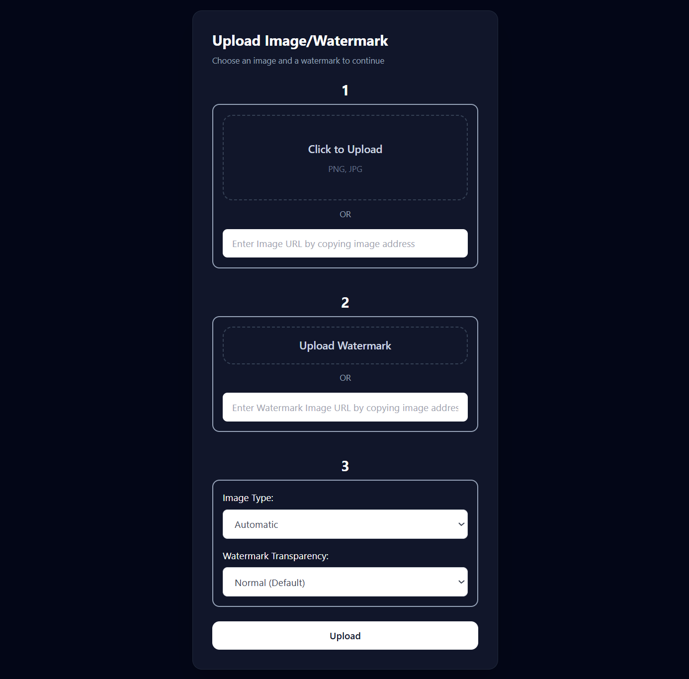
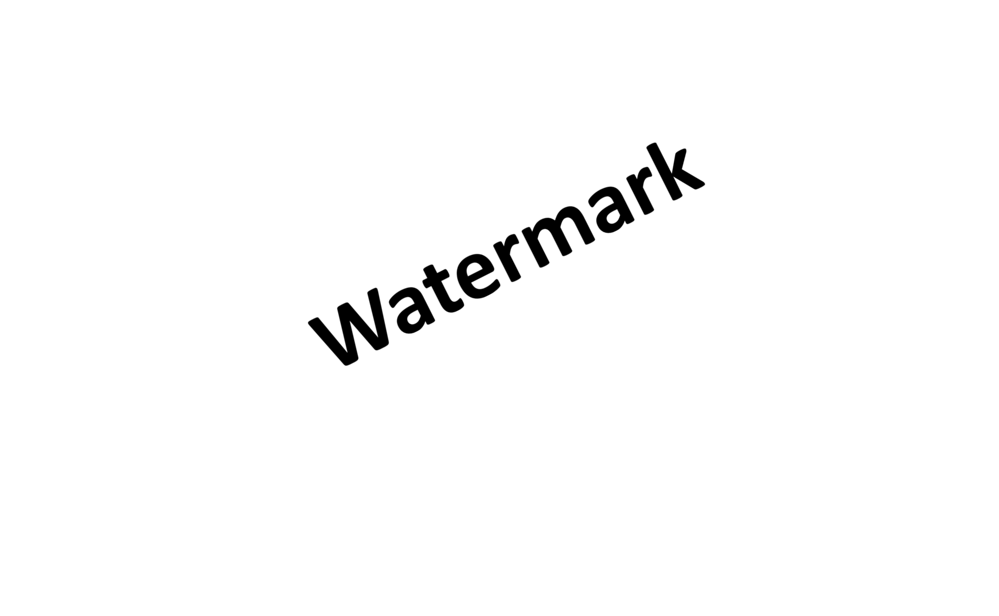
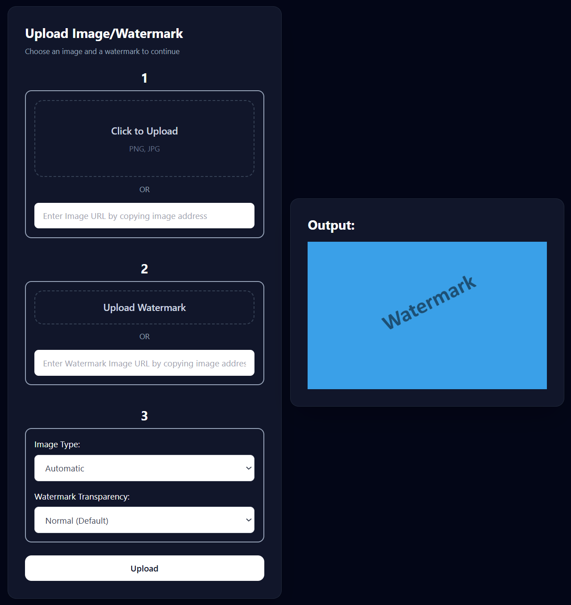
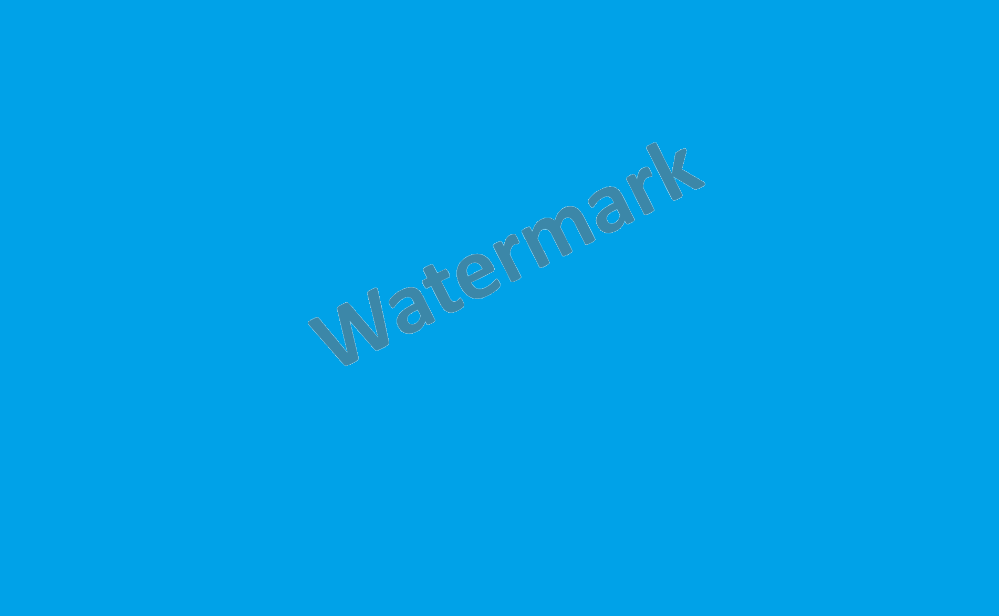

## 🖼️ Image Watermark Web App

An Image Watermarking Web App that allows users to upload or provide an image URL, upload a watermark or provide watermark URL, and download the
processed/watermarked image in different formats.

---

### 🪶 Features:

- Upload image **or use image URL**
- Upload watermark **or use watermark URL**
- Automatic watermark **background removal**
- Adjustable **watermark transparency**
- Multiple output formats **(JPG, PNG, WEBP, GIF, Automatic)**
- Automatic centered watermark placement
- Instant watermarked image output preview
- Download processed/watermarked image
- Flash messages for **user actions** and **error handling**

---

### ⚙️ Tech Stack:

- **Flask** - Backend
- **Pillow (PIL)** - Image processing library
- **HTML + Tailwind CSS + JS** - Frontend

---

### 📌Example Screenshots:

#### Index Page:

#### Uploaded Image:

#### Uploaded Watermark:

#### Output:

#### Output Watermarked Image:

